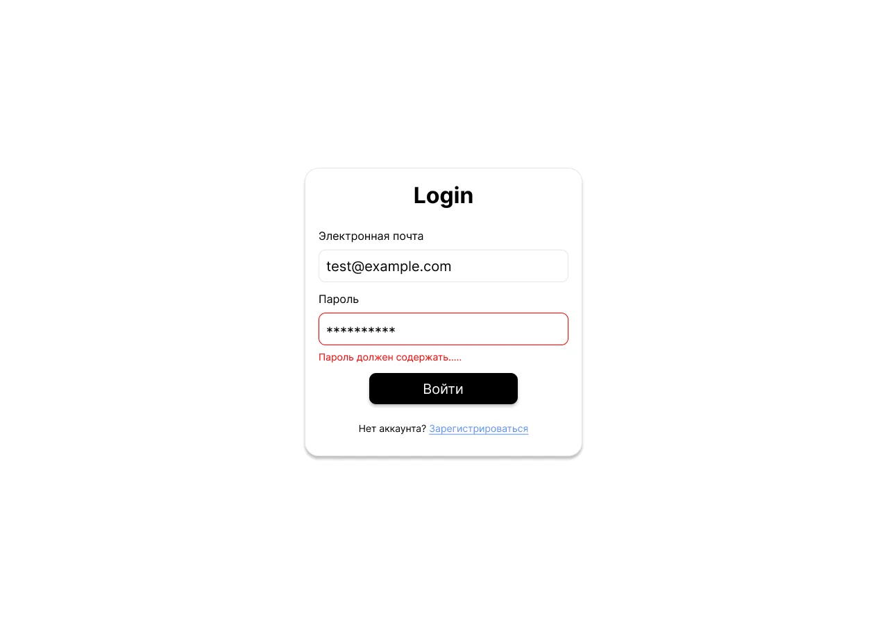
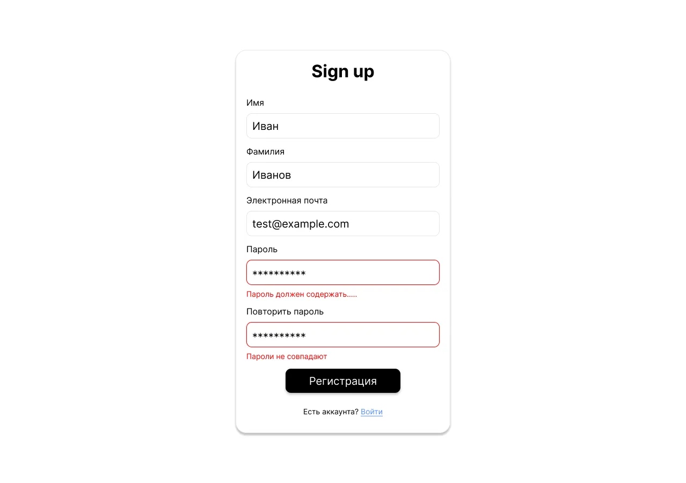

# Аутентификация

Регистрация, вход, выход и защита маршрутов. Эта фича отвечает за
переход «анонимный посетитель ↔ автор формы» (см. роли в
[глоссарии](../glossary.md)) и за то, какие страницы кому видны.

## Маршруты и доступ

| Маршрут   | Доступ              | Что это             |
|-----------|---------------------|---------------------|
| `/login`  | unauthorized only   | Страница входа      |
| `/signup` | unauthorized only   | Страница регистрации|

Кнопка «Выход» расположена в общей шапке (см.
[`app-shell.md`](./app-shell.md)) и работает на всех `protected`
страницах.

## Защита маршрутов (общие правила доступа)

Все страницы приложения помечены одним из трёх уровней доступа:

### `public`
Доступна всем, включая анонимных пользователей. Пример —
страница прохождения формы (`/forms/:formId`).

### `protected`
Доступна только пользователю с активной сессией. Поведение для
анонимного посетителя:
1. Перенаправление на `/login`.
2. На странице входа отображается сообщение:
   **«Для просмотра информации о пользователе необходимо войти в систему»**.

### `unauthorized only`
Доступна только анонимному посетителю. Поведение для пользователя
с активной сессией:
1. Перенаправление на главную страницу `/`.
2. На главной отображается сообщение: **«Вы уже вошли в систему»**.

## Страница входа (`/login`)

### Контент
- Форма с полями:
  - **Email**;
  - **Пароль**.
- Кнопка **«Войти»**.
- Ссылка **«Зарегистрироваться»** — на `/signup`.
- Блок с информацией об ошибке (отображается при возникновении).

### Валидация
- Поля проходят валидацию (правила определяются командой; разумный
  минимум: email — корректный формат, пароль — непустой).
- При ошибке валидации поле подсвечивается красным, под ним —
  текст с описанием ошибки.
- Кнопка «Войти» **неактивна**, если валидация не прошла или хотя
  бы одно поле пустое.

### Поведение
- По нажатию «Войти» форма отправляется и начинается процесс входа.
- При успехе — редирект на список форм пользователя (`/`).
- При неуспехе — отображается сообщение об ошибке (например,
  «Неверный Email или пароль»).

## Страница регистрации (`/signup`)

### Контент
- Форма с полями:
  - **Имя**;
  - **Фамилия**;
  - **Email**;
  - **Пароль**;
  - **Повтор пароля**.
- Кнопка **«Зарегистрироваться»**.
- Ссылка **«Войти»** — на `/login`.
- Блок с информацией об ошибке.

### Валидация
- Все поля проходят валидацию (правила определяются командой).
- **«Повтор пароля» должен совпадать с «Пароль»**.
- При ошибке валидации поле подсвечивается красным, под ним —
  текст с описанием ошибки.
- Кнопка «Зарегистрироваться» **неактивна**, если валидация не
  прошла или хотя бы одно поле пустое.

### Поведение
- По нажатию «Зарегистрироваться» форма отправляется и в хранилище
  создаётся новый пользователь.
- При успехе — пользователь **сразу авторизуется** (без отдельного
  входа) и перенаправляется на список форм (`/`).
- При неуспехе — отображается сообщение об ошибке (например,
  «Введенный Email уже занят»).

## Выход

- Триггер: ссылка **«Выход»** в общей шапке (см.
  [`app-shell.md`](./app-shell.md)).
- Сессия завершается, пользователь перенаправляется на `/login`.

## Состояния и сообщения

| Когда                                            | Сообщение                                                       |
|--------------------------------------------------|-----------------------------------------------------------------|
| Анонимный открыл `protected` страницу            | «Для просмотра информации о пользователе необходимо войти в систему» (на `/login`) |
| Авторизованный открыл `unauthorized only`        | «Вы уже вошли в систему» (на `/`)                               |
| Не удался вход                                   | «Неверный Email или пароль» (или аналогичное)                   |
| Не удалась регистрация                           | «Введенный Email уже занят» (или аналогичное)                   |

## Связанные фичи

- [`app-shell.md`](./app-shell.md) — шапка с кнопкой «Выход».
- [`forms-list.md`](./forms-list.md) — куда перенаправляет после
  входа/регистрации.
- [`profile.md`](./profile.md) — страница, ради которой обычно
  и вводится `protected`-сообщение.
