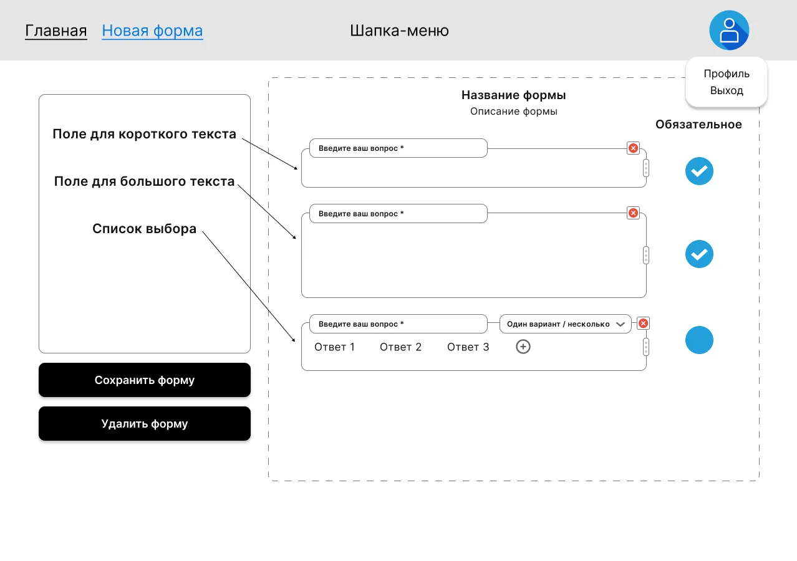

# Конструктор формы

Главный рабочий инструмент автора: страница, на которой собирается
структура формы — заголовок, описание и упорядоченный набор вопросов
разных типов. Здесь же форма сохраняется и удаляется.

## Маршруты и доступ

| Маршрут                  | Доступ      | Поведение                                      |
|--------------------------|-------------|------------------------------------------------|
| `/forms/new`             | `protected` | При переходе создаётся новая форма, сразу редирект на `/forms/:formId/edit` |
| `/forms/:formId/edit`    | `protected` | Основной адрес конструктора конкретной формы   |

## Контент страницы

### Шапка
Общая шапка приложения (см. [`app-shell.md`](./app-shell.md)).

### Боковое меню — типы вопросов
Список доступных типов вопросов, которые можно перетащить в форму:
- **Поле ввода для короткого текста**;
- **Поле ввода для большого текста**;
- **Список выбора** — флажки (checkbox) или переключатели (radio button).

### Рабочая область формы
- Поле для ввода **заголовка формы**;
- Поле для ввода **описания формы**;
- Место для добавленных **вопросов** (упорядоченный список).

### Карточка вопроса
Появляется в рабочей области после добавления. Содержит:
- поле ввода **тела вопроса**;
- **варианты ответа** (только если выбран тип «список выбора»);
- переключатель **обязательности** (да/нет);
- кнопку **«Удалить»**;
- **«6 точек»** (2 вдоль оси X × 3 вдоль оси Y) — захват для
  перетаскивания вопроса относительно других.

### Действия страницы
- Кнопка **«Сохранить»**.
- Кнопка **«Удалить форму»**.
- Кнопка **«Скопировать ссылку»** — копирует публичный URL формы
  (`/forms/:formId`, страница прохождения) в буфер обмена.
  Доступна только для уже сохранённой формы (т.е. на `/forms/:formId/edit`,
  но не на `/forms/new` до первого сохранения).
- Блок с **информацией об ошибке** (отображается при ошибке
  сохранения/удаления).
- **Сообщение об успешном изменении** формы (отображается после
  успешного сохранения).

## Поведение

### Боковое меню
- При перетаскивании поля из бокового меню в рабочую область
  элемент **добавляется в форму** и становится новым вопросом.

### Рабочая область
- Перетаскивание вопроса **за пределы** рабочей области — вопрос
  **удаляется** из формы.
- Перетаскивание вопроса **за «6 точек»** между другими вопросами
  внутри рабочей области — вопрос **меняет своё расположение**
  относительно других.
- По умолчанию новый добавленный вопрос **необязательный**.
- Кнопка «Удалить» в карточке вопроса — удаляет именно этот вопрос.

### Сохранение формы
- По нажатию «Сохранить» форма создаётся (если её ещё нет) либо
  обновляется, после чего показывается сообщение об успехе.
- При неуспехе — отображается сообщение об ошибке.

### Удаление формы
- По нажатию «Удалить форму» форма удаляется и пользователь
  перенаправляется на главную (`/`, см. [`forms-list.md`](./forms-list.md)).

### Получение публичной ссылки
После сохранения форма становится доступна по публичному адресу
`/forms/:formId` (страница прохождения, см. [`form-fill.md`](./form-fill.md)).
Автор получает эту ссылку через кнопку **«Скопировать ссылку»**:
по нажатию URL формы копируется в буфер обмена и (рекомендация)
показывается короткий toast-индикатор «Ссылка скопирована».
Кнопка скрыта/неактивна для несохранённой формы (на `/forms/new` до
первого «Сохранить») — копировать пока нечего.

## Валидация

- **Заголовок формы** обязателен для заполнения.
- Форма должна содержать **минимум один вопрос**.
- При ошибке валидации поле подсвечивается красным, под ним —
  текст с описанием ошибки.
- Кнопка **«Сохранить»** **неактивна**, если валидация не прошла
  или хотя бы одно обязательное поле не заполнено.

## Состояния и сообщения

| Когда                      | Что показываем                                  |
|----------------------------|-------------------------------------------------|
| Успешное сохранение        | Сообщение об успешном создании/обновлении формы |
| Ошибка сохранения/удаления | Блок с информацией об ошибке                    |
| Валидация не прошла        | Красная подсветка полей + тексты ошибок         |

## Связанные фичи

- [`forms-list.md`](./forms-list.md) — куда возвращает «Удалить форму»
  и куда ведёт кнопка «Редактировать форму» с карточки списка.
- [`form-fill.md`](./form-fill.md) — публичная страница, которая
  показывает результат работы конструктора.
- [`responses.md`](./responses.md) — кнопка «Редактировать форму»
  на странице отклика ведёт сюда.
- [`app-shell.md`](./app-shell.md) — шапка с пунктом «Новая форма».
