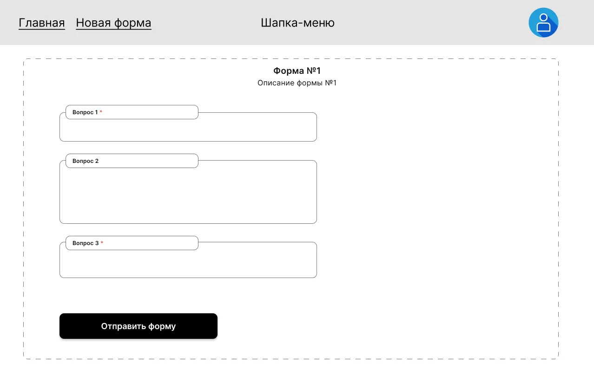

# Прохождение формы

Публичная страница, которую открывает респондент по ссылке. На ней
отрисованы вопросы конкретной формы, и здесь же отправляется отклик.

## Маршрут и доступ

| Маршрут           | Доступ   |
|-------------------|----------|
| `/forms/:formId`  | `public` |

Это **единственная `public` страница** среди фич с реальным контентом —
и единственная без общей шапки (см. [`app-shell.md`](./app-shell.md)).

## Контент страницы

- **Название** формы.
- **Описание** формы.
- Множество **вопросов** с полями ввода или вариантами ответа,
  отрисованных по своим типам:
  - короткий текст — однострочное поле;
  - длинный текст — многострочное поле;
  - список выбора — флажки или переключатели.
- **Обязательные** вопросы выделяются (например, красным со звёздочкой `*`).
- Кнопка **«Отправить»**.
- Сообщение об успешной отправке (отображается после успешной
  отправки — заменяет собой форму).

## Поведение

### Заполнение
Респондент отвечает на вопросы. Никакой авторизации не требуется
(см. роли в [глоссарии](../glossary.md)).

### Валидация и отправка
- Кнопка «Отправить» **неактивна**, если хотя бы одно **обязательное**
  поле не заполнено.
- По нажатию «Отправить» отклик отправляется на сервер.
- При успехе — **вместо формы** отображается сообщение об успешной
  отправке.

### Что не описано в ТЗ
- Поведение при ошибке отправки (сетевая ошибка, форма удалена и т.п.) —
  ТЗ молчит. При реализации показываем человекочитаемую ошибку,
  но конкретный текст не зафиксирован — обсудить отдельно.
- Возможность отправить отклик повторно — ТЗ молчит. По умолчанию
  считаем, что после успеха форма заменяется на сообщение и повторно
  отправить нельзя без перезагрузки страницы.

## Состояния

| Состояние               | Что показываем                       |
|-------------------------|--------------------------------------|
| Форма не заполнена / частично | Активная форма, кнопка «Отправить» неактивна |
| Все обязательные заполнены    | Кнопка «Отправить» активна                  |
| После успешной отправки       | Сообщение об успешной отправке вместо формы |

## Связанные фичи

- [`form-builder.md`](./form-builder.md) — здесь автор задаёт
  структуру вопросов и обязательность, которые отображаются на
  этой странице.
- [`responses.md`](./responses.md) — куда попадают отправленные отклики.
