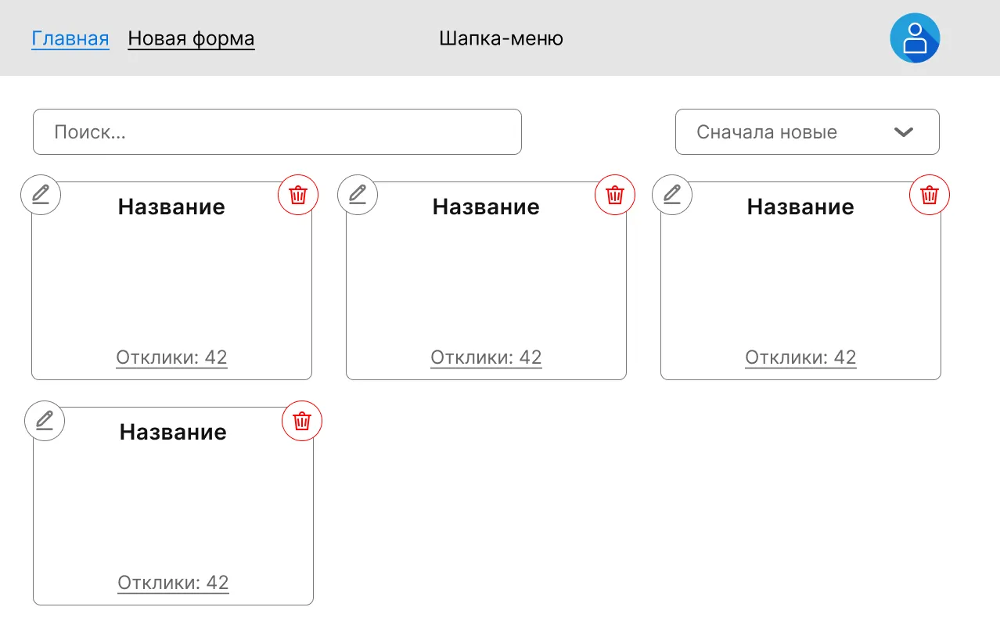

# Список форм (главная)

Главная страница автора. Здесь он видит все свои формы, ищет нужную
по названию, сортирует список и попадает в конструктор, отклики
или удаляет форму.

## Маршрут и доступ

| Маршрут | Доступ      |
|---------|-------------|
| `/`     | `protected` |

После успешного входа или регистрации (см. [`auth.md`](./auth.md))
пользователь попадает именно сюда.

## Контент страницы

- Общая шапка (см. [`app-shell.md`](./app-shell.md)).
- **Поле поиска** формы по названию.
- **Поле выбора сортировки** с вариантами:
  - дата создания — по возрастанию / убыванию;
  - количество откликов — по возрастанию / убыванию;
  - название — по алфавиту / в обратном порядке.
- **Список форм** — карточки. Каждая карточка содержит:
  - **Название** формы;
  - **Количество откликов** на форму;
  - кнопка **«Редактировать форму»** — ссылка на `/forms/:formId/edit`
    (см. [`form-builder.md`](./form-builder.md));
  - кнопка **«Посмотреть отклики»** — ссылка на `/forms/:formId/responses`
    (см. [`responses.md`](./responses.md));
  - кнопка **«Удалить форму»**.
- **Сообщение** при отсутствии форм (см. ниже).

## Поведение

### Поиск
- При вводе текста в поле поиска список фильтруется по названию.
- Если по запросу ничего не нашлось, отображается сообщение:
  **«Формы с данным названием не найдены»**.

### Сортировка
- При выборе варианта сортировки список перестраивается соответственно.

### URL-параметры
- Параметры **поиска и сортировки** добавляются в URL.
- Открытие страницы по такой ссылке должно восстановить состояние
  поиска и сортировки.

### Бесконечный скролл
- Если форм больше **30**, остальные подгружаются при скролле.

### Удаление
- При нажатии «Удалить форму» форма удаляется (вместе со своими
  откликами — см. [глоссарий](../glossary.md), раздел «Отклик»).
- После удаления карточка пропадает из списка.

## Состояния

### Пустой список
У пользователя нет ни одной формы — отображается сообщение:
**«У вас пока нет форм. Создайте первую»**.

### Поиск ничего не нашёл
**«Формы с данным названием не найдены»**.

### Загрузка следующей страницы
При бесконечном скролле — индикатор загрузки в конце списка.

## Связанные фичи

- [`form-builder.md`](./form-builder.md) — куда ведут «Новая форма»
  (из шапки) и «Редактировать форму» (с карточки).
- [`responses.md`](./responses.md) — куда ведёт «Посмотреть отклики».
- [`app-shell.md`](./app-shell.md) — шапка.
- [`auth.md`](./auth.md) — поведение защиты маршрута и сообщение
  «Вы уже вошли в систему» при заходе сюда из `unauthorized only`.
