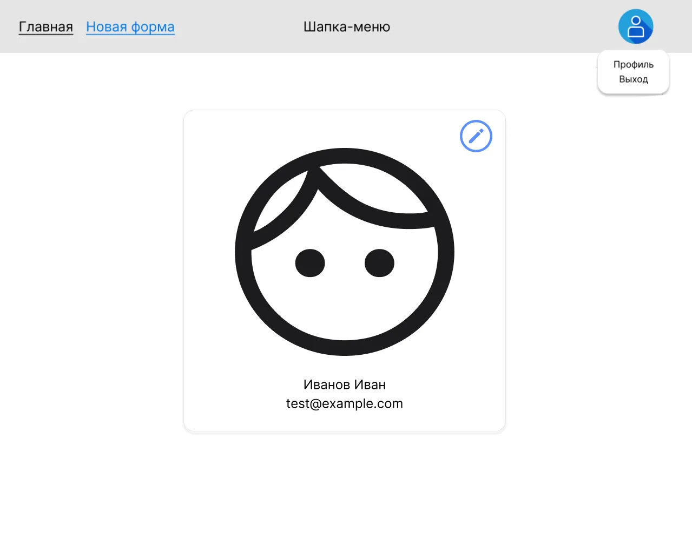
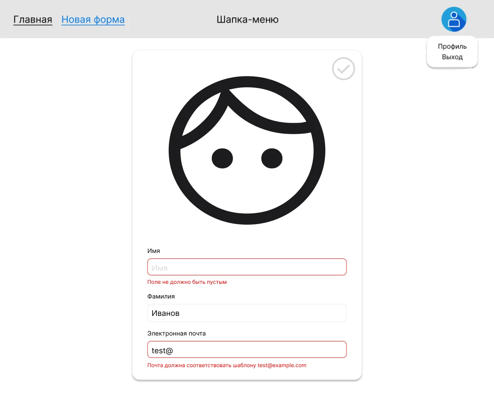
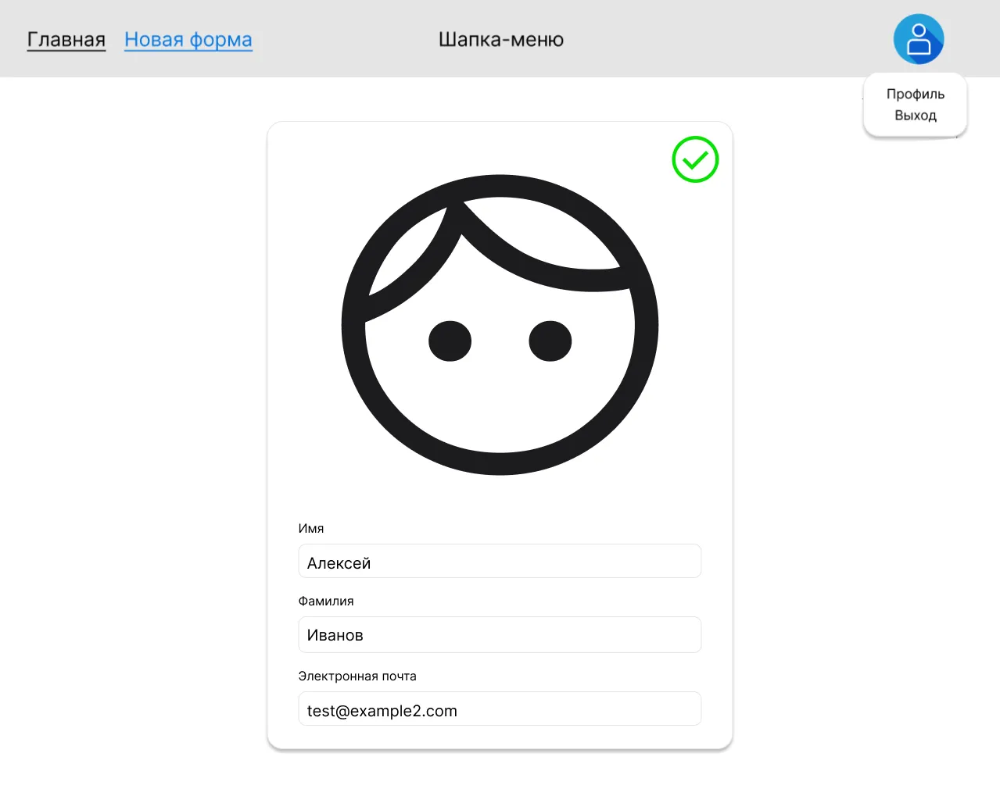

# Профиль пользователя

Страница, на которой автор формы может посмотреть и отредактировать
свои данные. Состоит из двух режимов одной карточки: просмотр и
редактирование.

## Маршрут и доступ

| Маршрут | Доступ      |
|---------|-------------|
| `/me`   | `protected` |

Поведение для анонимного пользователя описано в
[`auth.md`](./auth.md) (защита маршрутов).

## Контент страницы

- Общая шапка (см. [`app-shell.md`](./app-shell.md)).
- Карточка пользователя с полями ввода:
  - **Имя**;
  - **Фамилия**;
  - **Email**.
- Кнопка действия: **«Редактировать»** / **«Отменить»** / **«Сохранить»**
  (см. поведение ниже).
- Блок с информацией об ошибке (отображается при неуспешном сохранении).

## Состояния и поведение

Карточка имеет два режима — **просмотр** (по умолчанию) и **редактирование**.

### Режим просмотра
- Поля заполнены текущими данными, **недоступны для редактирования**.
- Видна одна кнопка — **«Редактировать»**.
- 

### Режим редактирования
- Все поля становятся **доступны для редактирования**.
- Кнопка «Редактировать» заменяется на **«Отменить»**.
- Как только пользователь меняет хотя бы одно поле — **рядом с
  «Отменить» появляется кнопка «Сохранить»**.
- При нажатии **«Отменить»** карточка возвращается в начальное
  состояние (исходные данные, режим просмотра, без кнопки «Сохранить»).

#### Поля заполнены неверно
- Поле подсвечивается красным, под ним — текст ошибки.
- Кнопка **«Сохранить»** **неактивна**, если валидация не прошла
  или хотя бы одно поле пустое.
- 

#### Поля заполнены верно
- Все валидации пройдены, кнопка **«Сохранить»** активна.
- 

### Сохранение
- По клику «Сохранить» данные отправляются в хранилище.
- При успехе: карточка возвращается в режим просмотра с обновлёнными
  значениями (т.е. снова появляется одна кнопка «Редактировать»).
- При неуспехе: отображается сообщение об ошибке (например,
  «Введенный Email уже занят»), карточка остаётся в режиме редактирования.

## Валидация

Конкретные правила определяются командой; разумный минимум:
- **Имя**, **Фамилия** — непустые;
- **Email** — корректный формат и не пустой.

## Связанные фичи

- [`auth.md`](./auth.md) — защита маршрута и обработка email-конфликта
  (тот же текст ошибки используется при регистрации).
- [`app-shell.md`](./app-shell.md) — шапка на этой странице.
