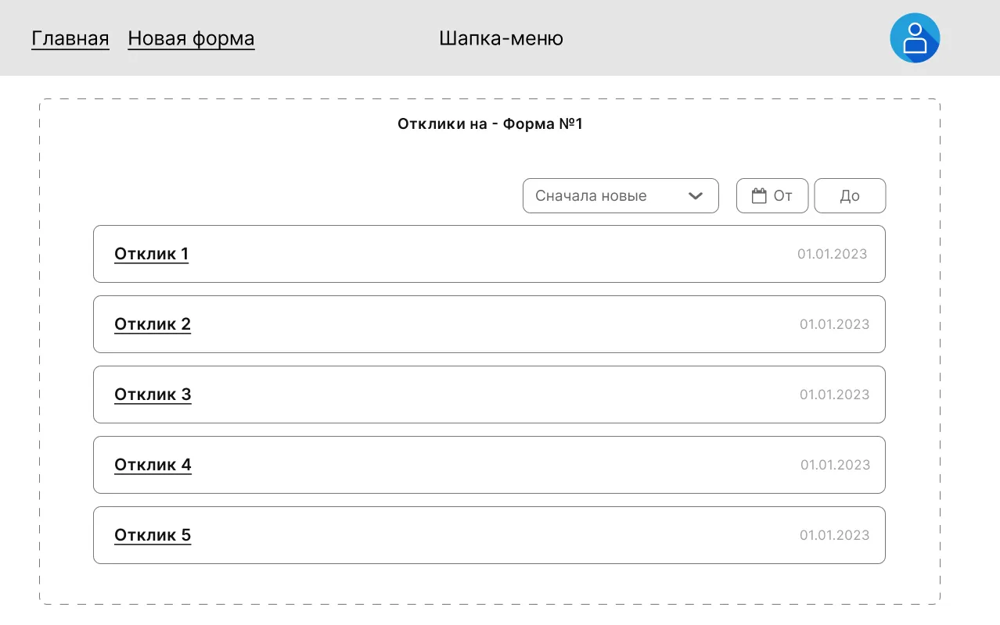
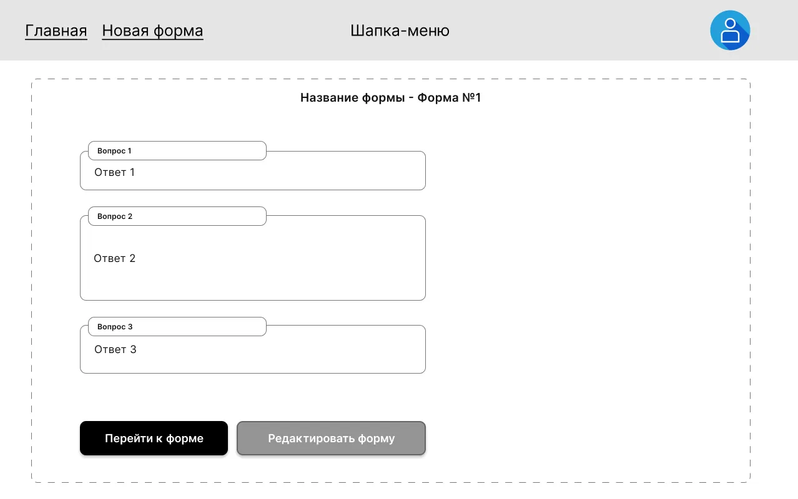

# Отклики

Две страницы, которыми автор формы пользуется для просмотра ответов
респондентов: список всех откликов на форму и просмотр одного
конкретного отклика. Объединены в один файл, потому что тесно связаны
по навигации и по контексту.

## Маршруты и доступ

| Маршрут                                            | Доступ      | Что это                       |
|----------------------------------------------------|-------------|-------------------------------|
| `/forms/:formId/responses`                         | `protected` | Список откликов на форму      |
| `/forms/:formId/responses/:responseId`             | `protected` | Просмотр одного отклика       |

Оба маршрута — `protected` (см. [`auth.md`](./auth.md)).

---

## Список откликов

### Контент

- Общая шапка (см. [`app-shell.md`](./app-shell.md)).
- **Название формы**, к которой относятся отклики.
- **Список откликов** — карточки. Каждая карточка содержит:
  - **Номер отклика** (порядковый в рамках формы) в качестве заголовка;
  - **Дата** отклика;
  - ссылка **«Перейти к отклику»** — на `/forms/:formId/responses/:responseId`.
- **Поле выбора сортировки** с вариантами:
  - сортировка **по дате** — по убыванию и по возрастанию.
- **Фильтр** — выбор диапазона дат:
  - дата **«от»** (день, месяц, год);
  - дата **«до»** (день, месяц, год).
- **Сообщение** при отсутствии откликов (см. ниже).

### Поведение

- **Бесконечный скролл**: если откликов больше **30**, остальные
  подгружаются по мере прокрутки.
- При выборе даты «от» / «до» происходит подгрузка данных с учётом
  выбранного диапазона.
- При выборе варианта сортировки список перестраивается соответственно.
- Параметры **фильтрации и сортировки** также добавляются в URL —
  открытие страницы по такой ссылке должно восстановить фильтр и сортировку.

### Состояния

| Когда                              | Что показываем                              |
|------------------------------------|---------------------------------------------|
| У формы нет ни одного отклика      | Сообщение **«Для данной формы нет откликов»** |
| Загрузка следующей страницы        | Индикатор загрузки в конце списка           |
| Применён фильтр и в нём пусто      | То же сообщение **«Для данной формы нет откликов»** |

---

## Просмотр одного отклика

### Контент

- Общая шапка (см. [`app-shell.md`](./app-shell.md)).
- **Название формы**, к которой относится отклик.
- Множество **вопросов формы** с **ответами на них**.
- Кнопка **«Перейти к форме»** — ссылка на `/forms/:formId`
  (см. [`form-fill.md`](./form-fill.md)).
- Кнопка **«Редактировать форму»** — ссылка на `/forms/:formId/edit`
  (см. [`form-builder.md`](./form-builder.md)).

### Поведение

Отдельного интерактивного поведения у этой страницы нет — она
read-only.

---

## Связанные фичи

- [`forms-list.md`](./forms-list.md) — кнопка «Посмотреть отклики»
  на карточке ведёт в список откликов.
- [`form-fill.md`](./form-fill.md) — куда отправляет «Перейти к форме».
- [`form-builder.md`](./form-builder.md) — куда отправляет
  «Редактировать форму».
- [`app-shell.md`](./app-shell.md) — шапка на обеих страницах.
- [`auth.md`](./auth.md) — защита маршрута.
